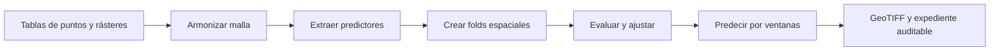

# Wall2Wall

Biblioteca ligera de Python para ajustar regresiones con observaciones puntuales y
producir mapas continuos a partir de predictores ráster ya disponibles.

**Estado: diseño y roadmap inicial. El paquete todavía no está implementado.**

Base de compatibilidad: **Python 3.11**, con un **entorno fijo por perfil**.
**WSL2/Linux con Micromamba es la opción recomendada**. Se prepara también
**Windows nativo con Conda y Git Bash o MSYS2**, sujeto a cualificación independiente.
Snakemake orquestará producción y Pytest usando el entorno del perfil elegido.
No se exige Snakemake para importar la biblioteca.

Caso ilustrativo: altura de árboles medida en campo, explicada por compuestos
Sentinel-1/Sentinel-2, elevación y variables bioclimáticas. Random Forest es el
modelo de referencia; LightGBM y XGBoost serán extras opcionales.

## Flujo previsto



Cada etapa tendrá una función Python y resultados inspeccionables. El mapa cubrirá
las celdas válidas; la evaluación espacial conservará predicciones fuera de muestra,
exclusiones y parámetros. Las alertas de extrapolación no son intervalos calibrados.

## Documentación para empezar

- [Definición del proyecto](00_brief/intake.md)
- [Diseño y API prevista](00_brief/architecture.md)
- [Contrato de validación](00_brief/validation.md)
- [Orquestación y entornos separados](00_brief/orchestration.md)
- [Opciones WSL y Windows y prevención de conflictos POSIX](ENVIRONMENT.md)
- [Instalación y operación práctica en Windows](06_infra/WINDOWS.md)
- [Investigación y fuentes](00_brief/research.md)
- [Decisiones aceptadas](00_brief/decisions.md)
- [Roadmap legible generado](docs/roadmap.md)
- [Plan y fronteras autoritativos](roadmap.yaml)

La implementación vivirá en `08_pkg/`. Los `pyproject.toml` y `tests/` raíz siguen
perteneciendo a la plantilla; instalar la raíz no instala Wall2Wall.

## Frontera actual

La sesión inicial preparó especificación, decisiones, estados y plan completo.
La ampliación D014 prepara además un entorno Windows aislado y su prueba técnica
en 06_infra/, independiente de la implementación científica.
No se han emitido prompts ni aceptado una baseline de producto. La primera tarea
prevista es una prueba desechable del entorno exacto; los demás hitos están
planificados. El piloto real requiere metadatos, permisos y protocolo posteriores.

El verificador raíz apunta a `08_pkg/tests/run_checks.py`, salida futura de la
primera tarea. Su ausencia produce fallo explícito hasta preparar las pruebas;
`roadmap: ok` únicamente comprueba la estructura del plan.

## Operación de la plantilla

El arquitecto delimita tareas; el programador implementa; el revisor comprueba la
aceptación usando evidencia. El ledger conserva la historia. No reescribirla.
Procedimiento: [docs/operating.md](docs/operating.md). Entorno:
[ENVIRONMENT.md](ENVIRONMENT.md). Compatibilidad:
[docs/upgrading.md](docs/upgrading.md).

Desde Bash en Linux/WSL2, con el entorno Micromamba Python 3.11 del proyecto
activado y PyYAML disponible:

```bash
python scripts/roadmap.py check
python scripts/roadmap.py render
python scripts/ledger.py status
```

Estos comandos validan/muestran el plan; no entrenan modelos ni generan prompts.
La operación es manual, sin runner autónomo activado. La publicación es una
acción humana independiente del desarrollo y la aceptación local.
